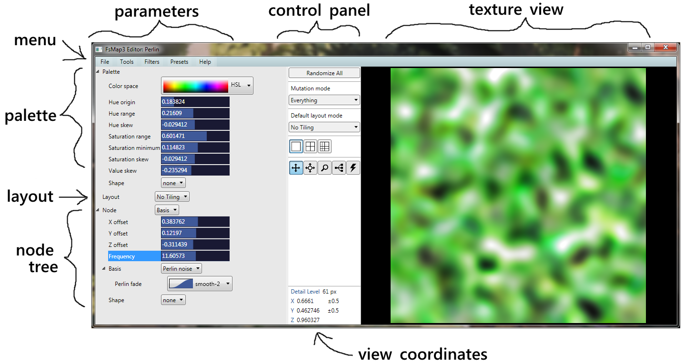

# FsMap3 Explorer User Guide

[TOC]

## Introduction

**FsMap3 Explorer** is a Windows GUI for creating and exploring *[procedural textures](http://en.wikipedia.org/wiki/Procedural_texture)*. Texture descriptions can be edited, loaded and saved, exported as images, randomized, mutated and evolved. This user guide helps you get started.

At the time of this writing, **FsMap3** is considered to be in alpha, which means that things are still changing rapidly. Backward compatibility of saved textures is not guaranteed until we move to beta.

## What Are Procedural Textures?

Procedural textures are images created by an algorithm from a simple description. The textures in **FsMap3** are *3-dimensional*. 3-textures are also called *solid textures* because they can be likened to solid slabs of material.

Because solid textures have a color everywhere in *3-space*, they can texture any object, no matter how complicated its surface. For example, a statue sculpted from marble shows a marble texture in its surface. As the sculptor chips away at the stone, the texture always maintains its general marble-like form, as the visible part is just the surface of something that is solid.

Technically, a **3-texture** is a box that accepts 3 numbers (**X**, **Y** and **Z**), processes them somehow, and cranks out another 3 numbers. The numbers that come out of the box can be interpreted as a color (for instance, in RGB format) and displayed, or they can be interpreted as another set of coordinates and forwarded to some other box for further processing.

These boxes are typically called **nodes** in texture editors. A complete procedural texture is built by connecting several nodes in a tree or graph.

## A Quick Look at the User Interface

Below is an example screenshot with the main sections delineated.

The user interface is divided horizontally into three parts: *parameters*, *control panel*, and *texture view*.

### Parameter Panel

The parameter panel contains all **parameters** of the texture under view. Together, the parameters completely define what the texture looks like. They are divided into three parts:

* **Palette** defines the color scheme of the texture. At each point in space, the final 3 values that emerge from the texture are colored according to the palette.

* **Global parameters** consists of just the layout for now. In the future, other parameters may be added. The *layout* determines how the texture *tiles*: not at all, along all axes, or only along X or Y axis.

* **Node tree** contains the meat of the texture definition. There are four types of nodes:
  * **Binary** nodes have two child branches, which are somehow combined. For example, the first child could be *layered* over the second child.

  * **Unary** nodes have a single child, which they modify. For example, the output from the child could be *overdriven*, effecting a contrasty and saturated look when viewed in color.

  * **Bases** are *leaves* of the node tree. They produce the basic texture content that is modified and combined. In the example screenshot, the whole tree consists of just one basis node containing [Perlin noise](http://en.wikipedia.org/wiki/Perlin_noise). You may be familiar with its look in the texture view on the right.
    * Every basis obeys the *layout* of the texture.
    * Every basis has a *frequency* parameter, which is the scale at which texture features occur. Doubling the frequency doubles the detail level.

  * **Fractalizers**, finally, are special nodes that take many basis samples and combine them. They are called fractalizers because, typically, samples are taken at different frequencies in a *[geometric progression](http://en.wikipedia.org/wiki/Geometric_progression)*. When combined, the result has fractal-like qualities because the same general look occurs at many scales.

The parameter panel can be resized by dragging the faintly gray vertical divider at the left of the control panel. If you are not interested in parameters, you can minimize the parameter panel by moving the divider all the way to the left.

### Control Panel

From top to bottom:

* **Randomize All** creates random textures in all visible views. The view coordinates  and zoom are reset.

* **Mutation mode** influences what kind of modifications are made when mutating a texture.
  * *Everything*: All parameters are mutated with equal probability.
  * *Colors and Effects*: Mostly, the palette, unary nodes, and basis shapes are mutated. (*Shapes* are extra modifiers available by default in basis nodes. They are very similar to unary nodes.)
  * *Scales and Offsets*: Mutate position and scale parameters. This is intended to maintain the overall flavor of the texture while rearranging and repositioning individual parts of it.
  * *Details*: Make small changes only, like what kind of interpolation is used, radii of basis features, and parameters of *mixing operators* like layering.
  * *Choose at Random*: One of the above modes is chosen randomly for each mutation.

* **Default layout mode** determines the layout mode chosen for random textures. Set this appropriately for the kind of textures you want to create. This setting has no influence on already created textures. (For those, you can simply change the layout parameter in the parameter panel.) 

  * **No Tiling**: The texture does not tile. In addition, individual instances of basis nodes are rotated randomly, to break as much as possible regularities arising from fixed orientations.
  * **Tile All**: All axes repeat at intervals of *1 unit*. Basically, the texture fills the space with copies of a unit sized cube. All basis frequencies are rounded to the nearest integer.
  * **Tile X Only**: Only the **X** axis repeats at an interval of 1 unit. All basis frequencies are rounded to the nearest integer.
  * **Tile Y Only**: Only the **Y** axis repeats at an interval of 1 unit. All basis frequencies are rounded to the nearest integer.
  * **Tile Z Only**: Only the **Z** axis repeats at an interval of 1 unit. All basis frequencies are rounded to the nearest integer.

* **View Modes**. This setting selects how the view panel is arranged. At the moment, there are three distinct view modes. When switching a mode, if there is a view in focus, it will be copied to the new mode.

  * **Big View**: There is one big view. The mutate tool is not available in this mode.

  * **2x2 Small Views**: There is a 2-by-2 grid of small views. Each view can be edited independently. The main attraction of this mode is *interactive evolution*: With the mutate tool, choose your favorite texture. The other 3 are then created as its variations. If one of them looks nicer than the original, choose it.

  * **Mosaic View**: The mosaic view is experimental. Its goal is to convey information about a large number of parameter settings at once. There is a 4-by-4 grid of small views. The views are independently editable but they are also *offset* from each other so that if the textures are identical, they form one big picture. The mutate tool works differently in this mode: besides making a few categorical changes, it attempts to mutate continuous parameters in *gradients* running from the top left to the bottom right view.

* **Tools** are for working with texture views. Inside views the left mouse button operates tools, while the right mouse button opens a context menu.

  * **Pan Tool**. To pan around, drag the view. Use the mouse wheel to control the **Z** coordinate.

  * **Pan-Zoom Tool**. To pan around, drag the view. Mouse wheel controls zoom: roll up to zoom in, down to zoom out.

  * **Zoom Tool**. Select the center of the area you want to zoom into and drag to choose the size of the area. Mouse wheel controls the **Z** coordinate.

  * **Mutate Tool**. The mutate tool can be used in *2x2* and *mosaic* views. Clicking on a view, mutated copies of it appear in the other views. Keep clicking on your favorite and it will (hopefully) evolve into something super impressive.

* **View Coordinates**. At the bottom of the control panel is the view info box where the coordinates of the view in focus are displayed. A view always shows a square slice of the texture in the XY plane, with positive **X** pointing right, positive **Y** pointing down, and **Z** being constant. The **Z** axis is depth and increases toward the screen.

### Texture View

The textures are displayed here. Any change to the parameters of a texture triggers an immediate re-render. Here, the left mouse button operates the current tool. The right mouse button accesses the **context menu**:

* **Maximize**: Take the texture to the big view mode.
* **Minimize**: Take the texture to the 2x2 small views mode.
* **View Mosaic**: Take the texture to the mosaic view mode.
* **Zoom Out**: Reduce zoom level by 50%.
* **Reset Zoom**: Reset zoom to default, which is a view area of 1x1 units.
* **Reset View**: Reset zoom and view area to *0..1* on **X** and **Y** axes. Reset **Z** to *0.5*.
* **Randomize**: Create a new random texture in this view.
* **Open in New Window**: Open the texture in a new explorer window.
* **Ray Traced Preview**: Open a window displaying a simple scene with diffuse textured cube, sphere and cylinder. For reflectance models we have Oren-Nayar for diffuse and Phong for specular. The camera strafes around the scene.

